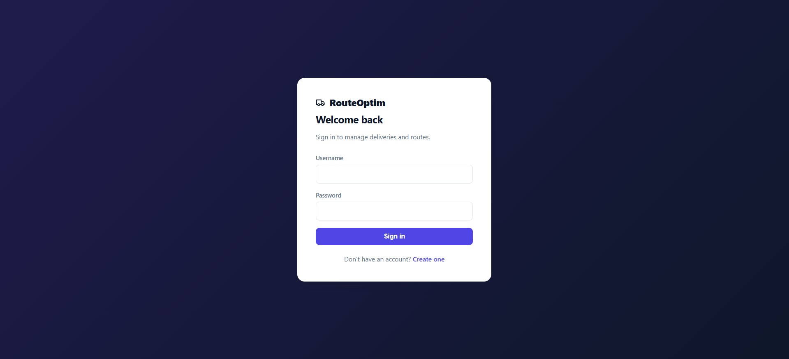
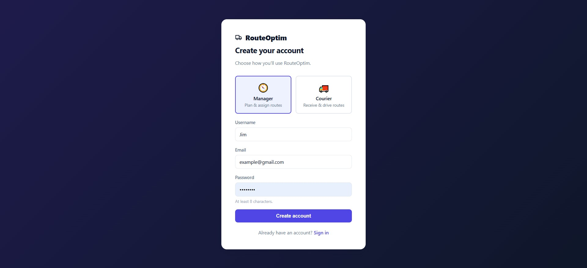
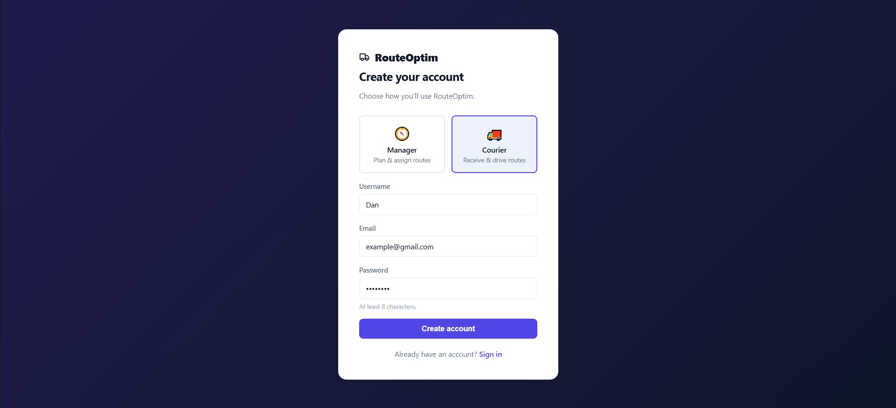
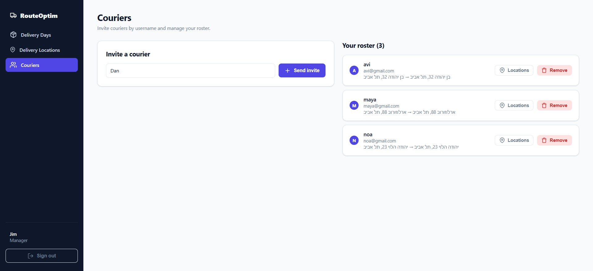
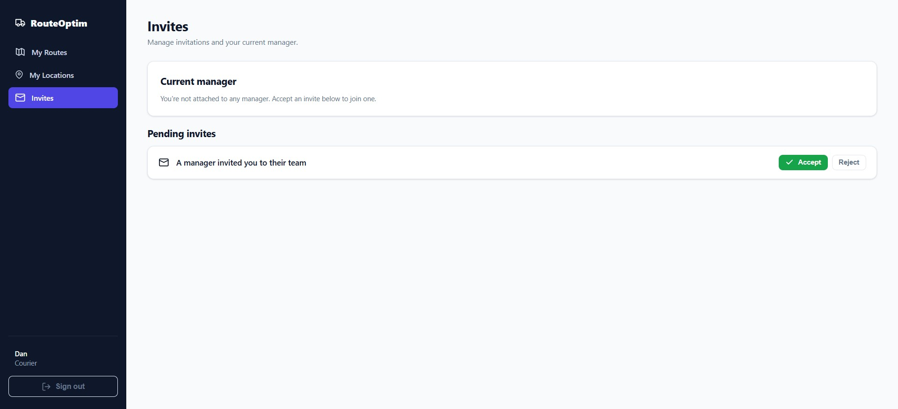
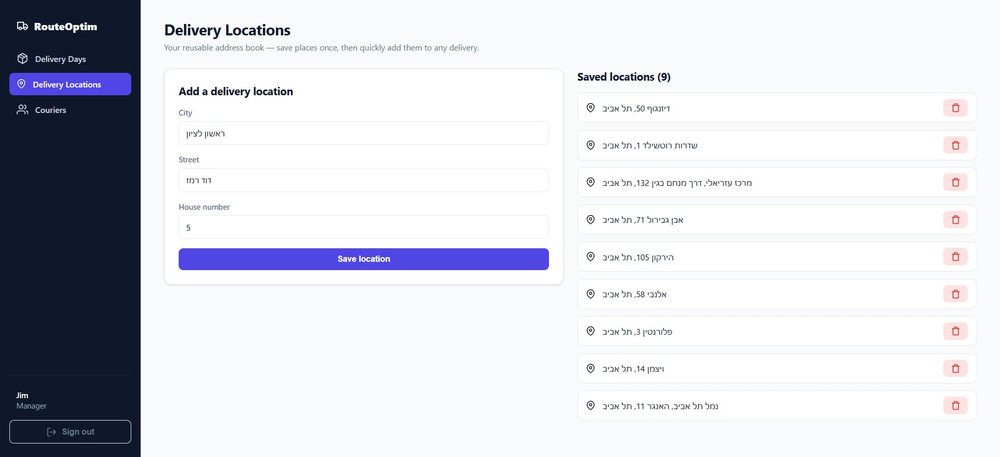
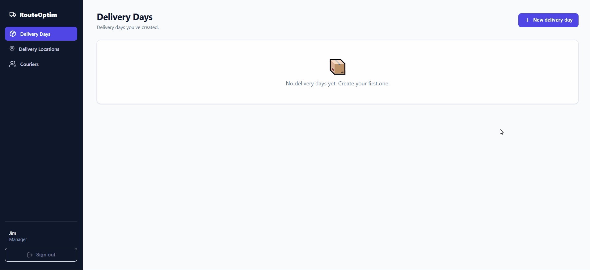
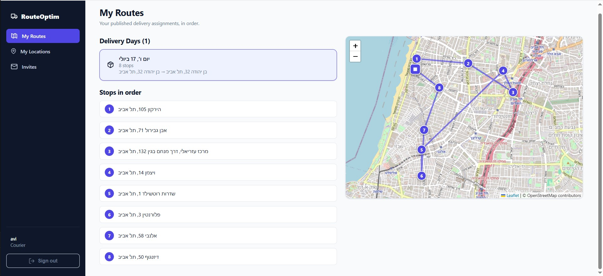

# Delivery Route Optimizer

A web app for managers to assign delivery stops to couriers with optimal routing.

FastAPI + SQLAlchemy + PostgreSQL, Celery + RabbitMQ, self-hosted OSRM (travel times), Photon (geocoding), React frontend — all in Docker Compose.

## Screenshots

**Sign in:**



**Registration** — pick a role at sign-up; managers plan routes, couriers drive them:





**Manager home** — delivery days at a glance:


**Couriers roster** — invite couriers by username and manage the team; each courier carries their own default start/end addresses:



**Courier invites** — the courier accepts or rejects a manager's invitation:



**Delivery address book** — reusable saved locations, validated via Photon geocoding (city → street → house number):



**Creating a delivery day** — pick a date and assign couriers:



**Route generation** — generating returns instantly with a pending option; a Celery worker solves in the background and the optimized per-courier split appears on the map over real OSRM road times:


**Refining an option** — move a stop to another courier (instant re-solve) or try the same day with a different number of couriers:


**Courier's view** — the published route, stops in driving order:



## Running the stack

```bash
cp .env.example .env      # then edit secrets (or keep the dev defaults)
docker compose up --build
```

Services:
- Backend API — http://localhost:8000 (docs at `/docs`)
- Frontend — http://localhost:5173
- OSRM routing — http://localhost:5001
- RabbitMQ management — http://localhost:15672

**First run** downloads the Israel region OSM extract (~115 MB) and preprocesses it for OSRM (`osrm-download` → `osrm-init`). This happens once; subsequent runs reuse the `osrm_data` volume. The backend runs `alembic upgrade head` automatically on boot.

## Tests

```bash
# Unit tests — no services needed (framework-agnostic algorithm package)
pytest tests/optimization

# Integration tests — require the stack to be up (real Postgres + OSRM + Photon)
docker compose up -d
API_BASE_URL=http://localhost:8000 pytest tests/integration
```

The integration suite auto-skips if the backend isn't reachable.
