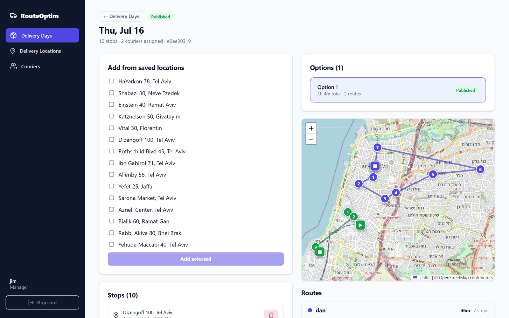
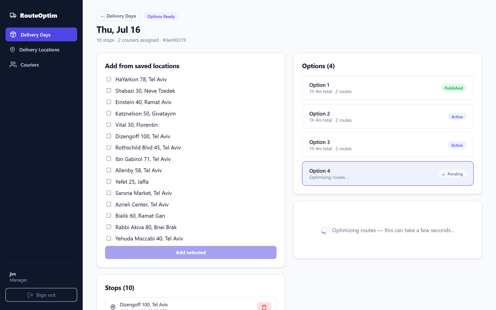
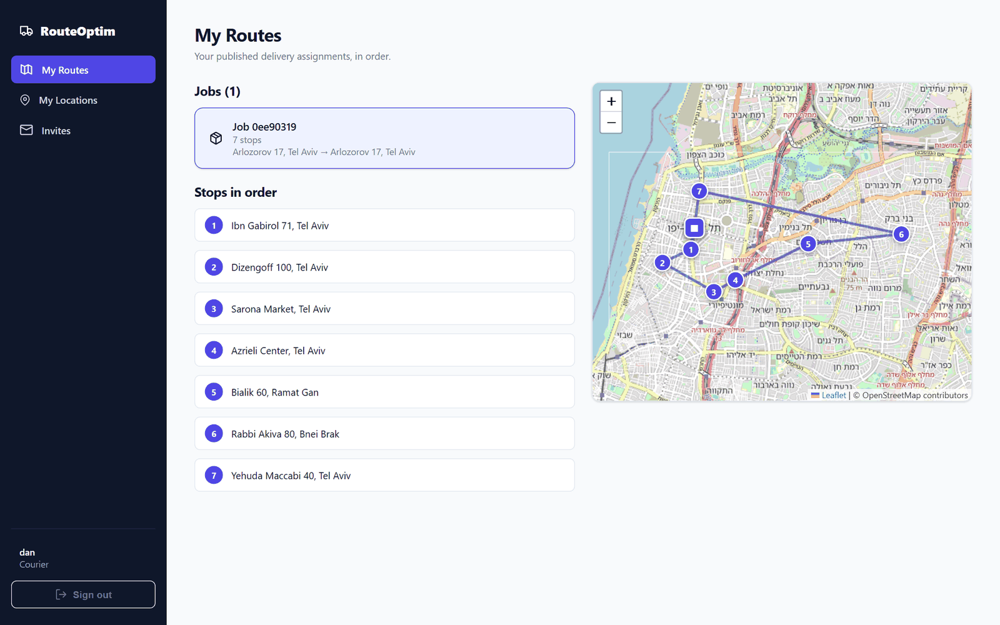
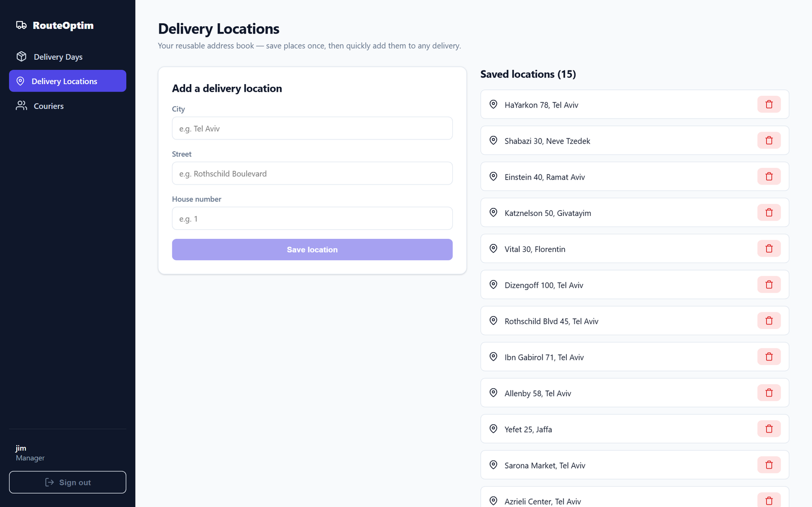

# Delivery Route Optimizer

A web app for managers to assign delivery stops to couriers with optimal routing.

FastAPI + SQLAlchemy + PostgreSQL, Celery + RabbitMQ, self-hosted OSRM (travel times), Photon (geocoding), React frontend — all in Docker Compose. See [architecture.md](architecture.md) for the full architecture.

## Screenshots

**Manager's delivery day** — stops, generated options, and each courier's optimized route drawn over real OSRM road times:



**Async route generation** — generating returns instantly with a pending option; a Celery worker solves in the background while the UI polls:



**Courier's view** — the published route, stops in driving order:



**Delivery address book** — reusable saved locations, validated via Photon geocoding:



## Running the stack

```bash
cp .env.example .env      # then edit secrets (or keep the dev defaults)
docker compose up --build
```

Services:
- Backend API — http://localhost:8000 (docs at `/docs`)
- Frontend — http://localhost:5173
- OSRM routing — http://localhost:5001
- RabbitMQ management — http://localhost:15672

**First run** downloads the Israel region OSM extract (~115 MB) and preprocesses it for OSRM (`osrm-download` → `osrm-init`). This happens once; subsequent runs reuse the `osrm_data` volume. The backend runs `alembic upgrade head` automatically on boot.

## Tests

```bash
# Unit tests — no services needed (framework-agnostic algorithm package)
pytest tests/optimization

# Integration tests — require the stack to be up (real Postgres + OSRM + Photon)
docker compose up -d
API_BASE_URL=http://localhost:8000 pytest tests/integration
```

The integration suite auto-skips if the backend isn't reachable.
